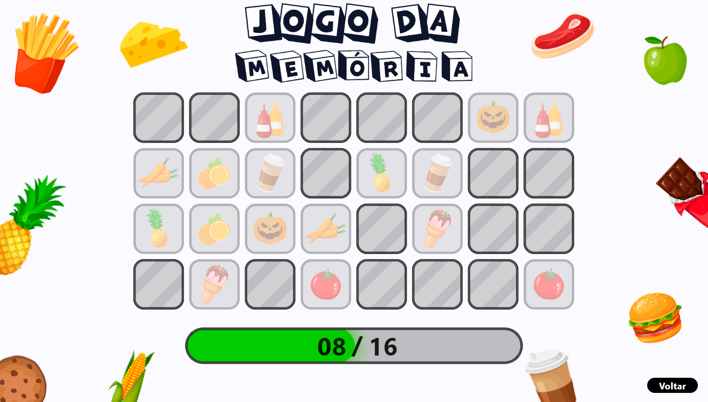

<h1 align="center">Jogo da Memória</h1>

  

  <a href="#-tecnologias">Tecnologias</a>&nbsp;&nbsp;&nbsp;|&nbsp;&nbsp;&nbsp;
  <a href="#-projeto">Projeto</a>&nbsp;&nbsp;&nbsp;

  

 

## 🚀 Tecnologias

Esse projeto foi desenvolvido em Python através da biblioteca Flet, utilizada, principalmente, para a construção de aplicativos do tipo Flutter.

## 💻 Projeto

Um jogo de memória desenvolvido em Python, projetado para aprimorar habilidades em diversas áreas da linguagem e proporcionar entretenimento ao jogador.
